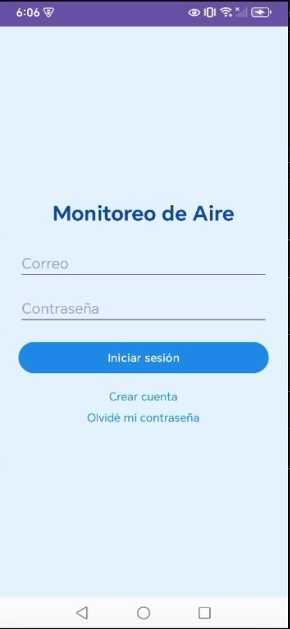
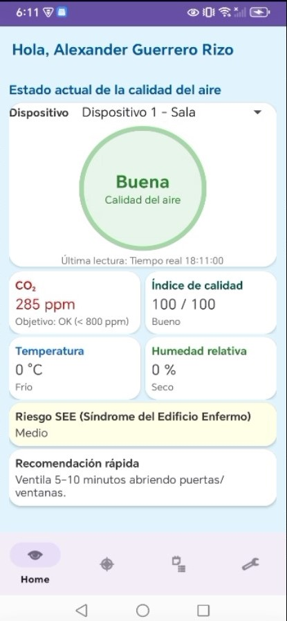
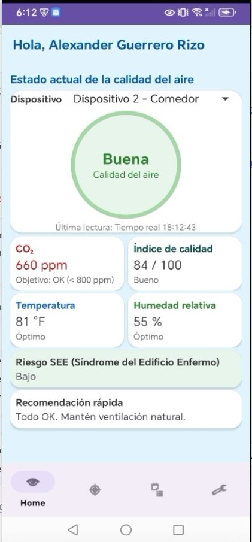
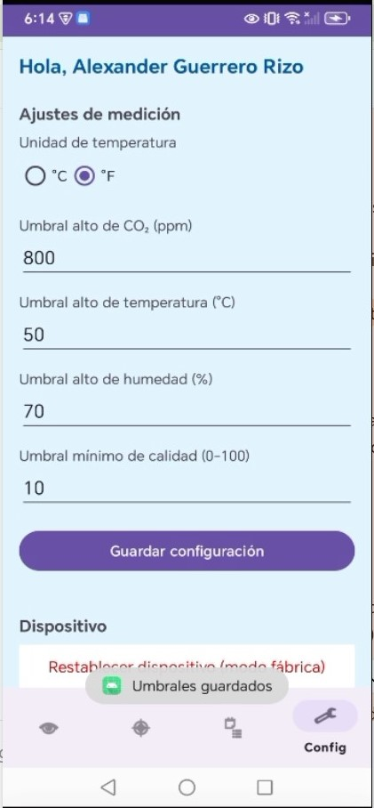

# Pruebas funcionales - Issue #2

## Entorno de prueba
- Rama: audit/funcional-2
- Backend/API: 
- Base de datos: 
- ESP32: 

## Evidencias (capturas)
1. App abre correctamente  
   

2. Lista de dispositivos  
   

3. Lecturas actualizadas (dispositivo 1)  
   

4. Cambio de dispositivo sin reiniciar  
   

5. Guardar umbrales / configuración  
   

## Resultados
- Flujo principal: 
- Cambio entre dispositivos: 
- Guardado de umbrales: 

